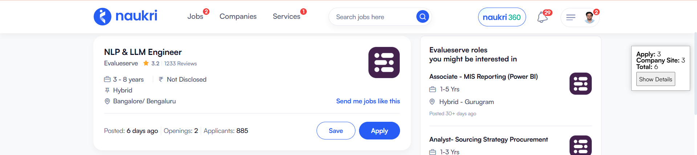
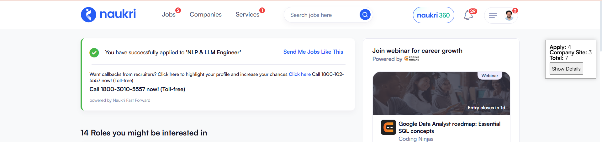
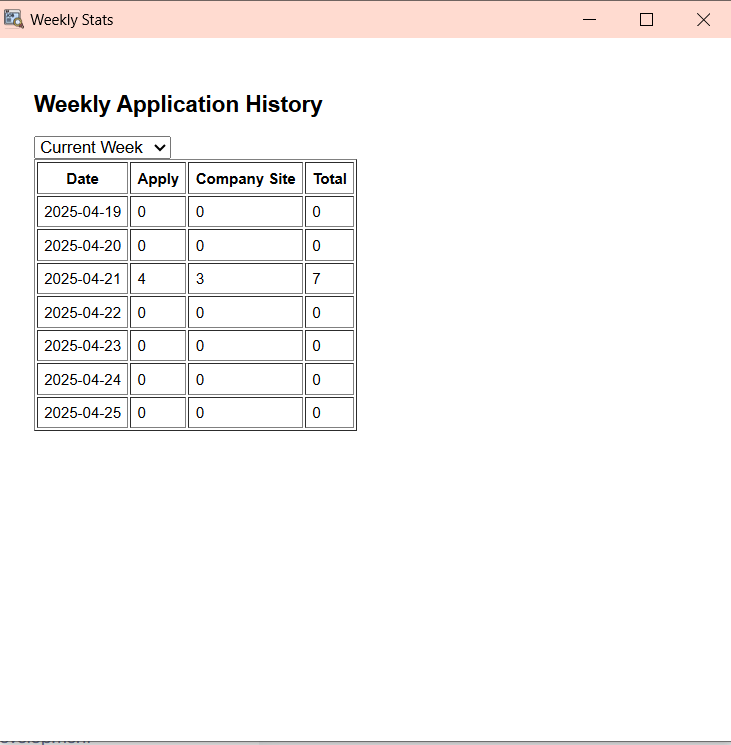

# Naukri Job Application Tracker Chrome Extension

Track your job applications on Naukri.com in real-time using this Chrome Extension.

---

## 🔻 How to Install and Use

### 1️⃣ Download the Extension
- Get the ZIP file of the extension folder.

### 2️⃣ Extract the ZIP
- Right-click → "Extract All" or use any unzip tool.

### 3️⃣ Replace the Icon
- Replace the `icon.png` inside the folder with your own 48x48 icon.
- Make sure it's named `icon.png`.

---

### 4️⃣ Upload to Google Chrome
1. Open Chrome and go to `chrome://extensions/`
2. Enable **Developer Mode** (top right)
3. Click **Load unpacked**
4. Choose the extracted extension folder

---

## 🌐 Naukri Website Walkthrough

### ▶️ Step 1: Before clicking on 'Apply'  

### ✅ Step 2: After clicking on 'Apply'  

### 📊 Step 3: Click on 'Show Details' to view the weekly Stats Panel  

---

## ⚙️ What Happens Behind the Scenes
- The floating box updates **Apply**, **Company Site**, and **Total** counts.
- Data is saved **locally** in your browser storage.
- Weekly view summarizes your applications by date in a table and line chart.
- No data is sent externally. 100% private.

---

Enjoy seamless tracking and stay organized! 🚀
